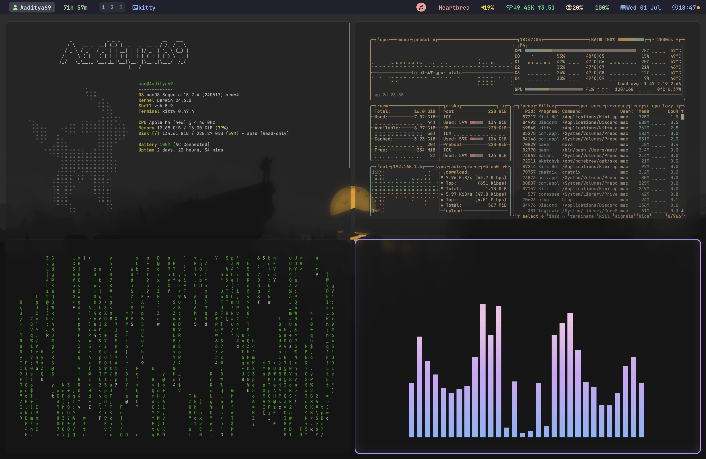
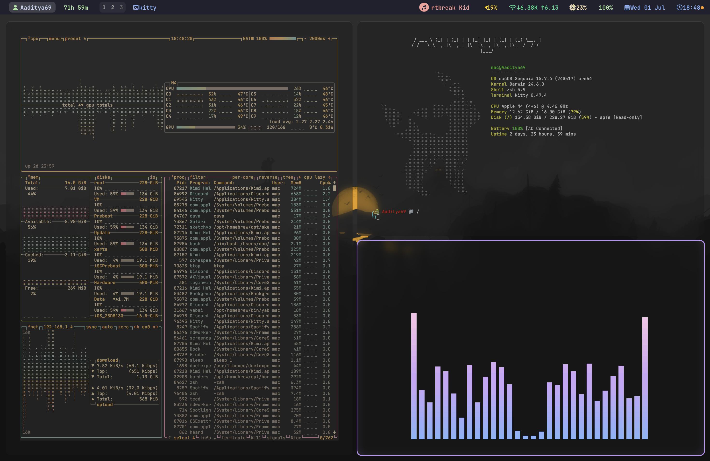

<div align="center">

# 🐉 macOS Sequoia Minimalist Rice

*A clean, minimal, keyboard-driven, and highly customizable desktop environment for macOS Sequoia.*

Designed for **Apple Silicon Macs** using **yabai**, **skhd**, **Kitty**, **SketchyBar**, **Starship**, **Fastfetch**, **btop**, and **cava**.

<p>


</p>

</div>

---

# 📖 About

This repository contains my complete macOS desktop environment and personal workflow.

It is much more than a collection of dotfiles. Every configuration, script, theme, and plugin has been carefully customized to create a fast, keyboard-driven, aesthetically pleasing, and productive workspace that I use every day.

The primary goals of this project are:

- ⚡ Improve productivity through keyboard-first navigation.
- 🎨 Create a clean and minimal desktop environment.
- 🔋 Keep resource usage and battery consumption low.
- 📚 Provide clear documentation so anyone can reproduce the setup.
- 🛠 Make customization simple and maintainable.

Whether you're completely new to macOS customization or already familiar with tiling window managers, this repository is designed to guide you through the entire setup process.

---

# ✨ Features

- 🪟 Dynamic tiling window management using **yabai**
- ⌨️ Powerful keyboard shortcuts with **skhd**
- 🐱 GPU-accelerated Kitty terminal
- ⭐ Beautiful Starship shell prompt
- 📊 Real-time system monitoring with btop
- ⚡ Pokémon-themed Fastfetch configuration
- 🎵 Audio visualization using cava
- 📈 Highly customized SketchyBar
- 🎨 Gruvbox Material inspired appearance
- 🔄 Backup and restore scripts
- 🚀 Automated installation
- 🍎 Optimized for Apple Silicon Macs

---

# 🎯 Philosophy

This setup follows a few simple principles:

- Keyboard over mouse.
- Simplicity over complexity.
- Functionality over unnecessary effects.
- Consistency across every application.
- Documentation over guesswork.

> **"Day One, not One Day."**

That philosophy drives every change made in this repository.

---

# 📚 Table of Contents

- [📸 Screenshots](#-screenshots)
- [✨ Features](#-features)
- [🖥️ System Requirements](#️-system-requirements)
- [🚀 Installation](#-installation)
- [🔒 System Integrity Protection (SIP)](#-system-integrity-protection-sip)
- [📂 Repository Structure](#-repository-structure)
- [⚙️ Components](#️-components)
- [⌨️ Keyboard Shortcuts](#️-keyboard-shortcuts)
- [🎨 Customization](#-customization)
- [🔊 Audio Setup](#-audio-setup)
- [🔄 Backup & Restore](#-backup--restore)
- [🛠 Troubleshooting](#-troubleshooting)
- [❓ Frequently Asked Questions](#-frequently-asked-questions)
- [🙏 Credits](#-credits)
- [📜 License](#-license)

---

# ❤️ Why I Built This

I started this project because I wanted a desktop environment that was:

- fast
- minimal
- distraction-free
- enjoyable to use every day

Along the way I learned about shell scripting, window managers, terminal customization, desktop automation, and system configuration.

Instead of keeping everything private, I decided to document the entire setup so anyone can recreate, learn from, or build upon it.

If this repository helps you, consider giving it a ⭐ on GitHub.

---

# 📸 Screenshots

A few previews of the desktop environment.

> **Note**
>
> The appearance may change slightly over time as the setup continues to evolve.

## 🖥️ Current Desktop

<div align="center">

| Clean Desktop | Full Workspace |
|:--------------:|:--------------:|
|  |  |

</div>

---

## 🔄 Evolution

<div align="center">

| Previous Version | Latest Version |
|:----------------:|:--------------:|
|  |  |

</div>

---

# 🖥️ Desktop Layout

The default startup layout opens four terminal applications arranged in a grid.

```text
┌──────────────────────────────┬──────────────────────────────┐
│                              │                              │
│          btop                │         Fastfetch            │
│                              │                              │
│   CPU • Memory • Network     │   Pokémon System Overview    │
│                              │                              │
├──────────────────────────────┼──────────────────────────────┤
│                              │                              │
│         cmatrix              │            cava              │
│                              │                              │
│     Matrix Animation         │    Audio Visualizer          │
│                              │                              │
└──────────────────────────────┴──────────────────────────────┘
```

This layout is automatically restored when launching the configured Kitty session, providing a ready-to-use monitoring and productivity workspace.

---

# ✨ What You're Looking At

### 🐱 Kitty Terminal

- GPU accelerated rendering
- Transparency & blur
- Gruvbox Material theme
- Custom font configuration
- Automatic session support

---

### 🪟 yabai

- BSP tiling layout
- Keyboard-driven navigation
- Automatic window placement
- Floating window support
- Native macOS integration

---

### ⌨️ skhd

- Vim-inspired keybindings
- Window movement
- Window swapping
- Layout balancing
- Quick application shortcuts

---

### 📈 SketchyBar

Displays important system information directly in the menu bar.

Including:

- Battery
- CPU
- Memory
- Network
- Current Application
- Date & Time
- Volume
- Music
- Workspace Indicator

---

### ⚡ Fastfetch

Customized to display:

- Pokémon-themed logo
- Hardware information
- Operating System
- CPU
- Memory
- GPU
- Disk Usage
- Shell
- Terminal
- Packages
- Uptime

---

### 📊 btop

A modern terminal system monitor showing:

- CPU usage
- Memory usage
- Processes
- Network traffic
- Disk activity
- Temperatures

---

### 🎵 cava

Real-time terminal audio visualization using **Background Music** as the audio source.

---

# 💡 Why Multiple Screenshots?

The screenshots demonstrate different aspects of the setup:

| Screenshot | Purpose |
|------------|---------|
| `desktop_clean.png` | Minimal desktop appearance |
| `desktop_full.png` | Full working environment |
| `mac-setup.png` | Older version of the setup |
| `mac-setup1.png` | Latest refined version |

As the project evolves, these screenshots will continue to be updated to reflect the latest improvements.


---

# 🖥️ System Requirements

Before installing this setup, ensure your system meets the following requirements.

## ✅ Supported macOS Versions

| Version | Supported |
|----------|:---------:|
| macOS Sequoia | ✅ Recommended |
| macOS Sonoma | ✅ Supported |
| macOS Ventura | ⚠️ Mostly Compatible |
| Older Versions | ❌ Not Tested |

> **Note**
>
> This setup is actively developed and tested on **macOS Sequoia**.

---

# 💻 Hardware

Although most components work on any Mac, this repository is primarily optimized for Apple Silicon.

| Hardware | Status |
|----------|:------:|
| Apple M1 | ✅ |
| Apple M2 | ✅ |
| Apple M3 | ✅ |
| Apple M4 | ✅ Recommended |
| Intel Macs | ⚠️ Mostly Compatible |

---

# 📦 Required Software

The following applications are required for the complete experience.

| Software | Purpose |
|----------|---------|
| Homebrew | Package Manager |
| Kitty | Terminal Emulator |
| yabai | Tiling Window Manager |
| skhd | Hotkey Daemon |
| SketchyBar | Status Bar |
| Fastfetch | System Information |
| btop | System Monitor |
| cava | Audio Visualizer |
| Starship | Shell Prompt |
| Background Music | Audio Routing |
| SwitchAudioSource | Audio Switching Utility |
| JankyBorders | Window Borders (yabai v7+) |

---

# 🔤 Fonts

For the best experience install a Nerd Font.

Recommended:

- JetBrainsMono Nerd Font
- MesloLGS Nerd Font
- FiraCode Nerd Font

JetBrainsMono Nerd Font is the font used throughout this repository.

---

# 🍺 Homebrew

If Homebrew is not already installed:

```bash
/bin/bash -c "$(curl -fsSL https://raw.githubusercontent.com/Homebrew/install/HEAD/install.sh)"
```

Verify the installation:

```bash
brew --version
```

---

# 📦 Recommended Packages

These packages are either required or highly recommended.

```bash
brew install \
kitty \
yabai \
skhd \
btop \
fastfetch \
cava \
starship \
switchaudio-osx

brew install --cask \
background-music
```

If using yabai v7 or newer:

```bash
brew install FelixKratz/formulae/borders
```

---

# 🍎 System Permissions

Several components require macOS permissions to function correctly.

Please grant access when prompted.

| Permission | Required For |
|------------|--------------|
| Accessibility | yabai, skhd |
| Screen Recording | SketchyBar (optional widgets) |
| Automation | AppleScript integrations |
| Full Disk Access | Optional scripts |

You can manage these permissions under:

**System Settings → Privacy & Security**

---

# 🔒 System Integrity Protection (SIP)

Some advanced yabai features require changes to System Integrity Protection.

This repository includes both:

- Full SIP configuration
- Partial SIP configuration

A complete guide is provided later in this documentation.

If you only want basic tiling functionality, you can keep SIP enabled.

---

# 🌐 Internet Connection

The installer downloads packages using Homebrew.

A stable internet connection is recommended during installation.

---

# 📁 Disk Space

Approximate storage requirements.

| Component | Size |
|-----------|------|
| Homebrew Packages | ~2 GB |
| Fonts | ~200 MB |
| Repository | <100 MB |

---

# ⚡ Recommended Terminal

Although the configuration may work elsewhere, it is designed specifically for **Kitty**.

Using another terminal may result in:

- Missing transparency
- Broken layouts
- Font rendering differences
- Session incompatibilities

For the intended experience, use Kitty.

---

# 🧠 Before You Continue

This repository modifies:

- shell configuration
- keyboard shortcuts
- terminal appearance
- window management
- status bar
- system utilities

If you already have existing configurations, it is recommended to create backups before installing.

Later sections explain how to back up and restore your configuration safely.


---

# 🚀 Installation

This section walks you through setting up the complete environment from scratch.

If you're installing this setup on a fresh macOS installation, simply follow the steps in order.

---

## 1️⃣ Clone the Repository

Clone the repository into your home directory.

```bash
git clone https://github.com/ElAaditya69/my-mac-setup.git ~/my-mac-setup

cd ~/my-mac-setup
```

---

## 2️⃣ Review the Repository

Before installing, it's a good idea to see what has been included.

```text
my-mac-setup/
├── install.sh
├── .yabairc
├── .skhdrc
├── .zshrc
├── kitty/
├── fastfetch/
├── btop/
├── cava/
├── starship/
├── sketchybar/
├── scripts/
└── screenshots/
```

---

## 3️⃣ Run the Installer

The easiest method is to use the included installer.

```bash
chmod +x install.sh

./install.sh
```

The installer is responsible for copying configuration files and preparing the environment.

---

## 4️⃣ Manual Installation

If you prefer installing everything yourself, copy the configuration files manually.

```bash
cp .yabairc ~/.yabairc

cp .skhdrc ~/.skhdrc

cp .zshrc ~/.zshrc
```

Configuration folders:

```bash
mkdir -p ~/.config

cp -R kitty ~/.config/

cp -R fastfetch ~/.config/

cp -R btop ~/.config/

cp -R cava ~/.config/

cp -R starship ~/.config/

cp -R sketchybar ~/.config/
```

---

## 5️⃣ Start Required Services

Start yabai and skhd.

```bash
yabai --start-service

skhd --start-service
```

Reload your shell.

```bash
source ~/.zshrc
```

---

## 6️⃣ Launch the Workspace

If your Kitty session file is present:

```bash
kitty --session ~/.config/kitty/session.conf
```

This opens the default workspace layout included with the repository.

---

# ✅ Verify the Installation

Everything should now be working.

Check the following:

- Kitty launches correctly.
- yabai tiles windows.
- skhd keyboard shortcuts respond.
- SketchyBar appears.
- Fastfetch displays correctly.
- btop opens.
- cava detects audio.
- Starship prompt loads.

---

# 🔄 Updating the Repository

To update your local copy:

```bash
cd ~/my-mac-setup

git pull origin main
```

If configuration files changed, rerun the installer or copy the updated files manually.

---

# 🗑️ Uninstall

To remove the repository:

```bash
rm -rf ~/my-mac-setup
```

If desired, also remove copied configuration files from your home directory.

Examples:

```bash
rm ~/.yabairc

rm ~/.skhdrc

rm ~/.zshrc

rm -rf ~/.config/kitty

rm -rf ~/.config/fastfetch

rm -rf ~/.config/btop

rm -rf ~/.config/cava

rm -rf ~/.config/starship

rm -rf ~/.config/sketchybar
```

---

# 💡 Installation Tips

- Restart your terminal after installation.
- Grant Accessibility permissions to yabai and skhd.
- Install a Nerd Font before using the configuration.
- Follow the SIP guide if advanced yabai features are required.
- If something doesn't work, refer to the Troubleshooting section later in this document.

---

# 🔒 System Integrity Protection (SIP)

One of the most common questions new users have is:

> **"Do I need to disable SIP?"**

The short answer is:

**Not always.**

Basic window tiling works without modifying SIP, but some advanced features of **yabai** require additional permissions.

This section explains everything you need to know before making any changes.

---

# 🛡️ What is SIP?

System Integrity Protection (SIP) is a security feature built into macOS that protects important system files and processes from being modified.

Apple enables SIP by default on every Mac.

Its purpose is to prevent malicious software from gaining elevated access to the operating system.

---

# 🤔 Why Does yabai Need SIP Changes?

yabai can operate in two different modes.

## Without Changing SIP

You can still use:

- ✅ Automatic window tiling
- ✅ Window movement
- ✅ Window resizing
- ✅ Keyboard shortcuts
- ✅ BSP layouts
- ✅ Floating windows

For many users, this is more than enough.

---

## With the Scripting Addition

Some advanced functionality requires installing yabai's scripting addition.

This enables features such as:

- Window stacking
- Native space management
- Window opacity control
- Advanced animations
- Better control over Mission Control
- Additional window manipulation APIs

These features require relaxing certain SIP protections.

---

# 📊 Which Option Should I Choose?

| Option | Recommended For |
|---------|-----------------|
| Leave SIP Enabled | Most users |
| Partial SIP | Power users (Recommended) |
| Fully Disable SIP | Advanced users only |

---

# ✅ Check Your Current SIP Status

Open Terminal and run:

```bash
csrutil status
```

Typical output:

```text
System Integrity Protection status: enabled.
```

---

# ⭐ Option 1 — Keep SIP Enabled

This is the safest option.

You'll still have:

- Automatic tiling
- Keyboard shortcuts
- Layout management
- Window movement
- Window resizing

No additional configuration is required.

---

# ⭐⭐ Option 2 — Partial SIP (Recommended)

This is the option recommended by the yabai developer for users who want advanced functionality while keeping most macOS protections intact.

### Step 1

Restart your Mac.

---

### Step 2

Hold:

```
⌘ + R
```

until Recovery Mode appears.

---

### Step 3

Open:

```
Utilities
↓

Terminal
```

---

### Step 4

Run:

```bash
csrutil enable --without fs --without debug
```

---

### Step 5

Restart macOS.

---

### Step 6

Install the scripting addition.

```bash
sudo yabai --install-sa
```

Load it.

```bash
sudo yabai --load-sa
```

Restart yabai.

```bash
yabai --restart-service
```

---

# ⭐⭐⭐ Option 3 — Disable SIP Completely

Only recommended if you understand the security implications.

Boot into Recovery Mode again.

Run:

```bash
csrutil disable
```

Restart normally.

---

# 🔄 Re-enable SIP

If you ever wish to restore Apple's default security configuration:

Boot into Recovery Mode.

Run:

```bash
csrutil enable
```

Restart your Mac.

---

# 🔍 Verify the Scripting Addition

Run:

```bash
sudo yabai --check-sa
```

If everything is working correctly, yabai will report that the scripting addition is installed and loaded.

---

# ⚠️ Common Problems

## "cannot connect to socket"

Usually means yabai isn't running.

Restart it:

```bash
yabai --restart-service
```

---

## "scripting addition failed"

Try reinstalling it.

```bash
sudo yabai --uninstall-sa

sudo yabai --install-sa

sudo yabai --load-sa
```

---

## "Operation not permitted"

This almost always indicates that SIP settings do not match the desired yabai configuration.

Verify:

```bash
csrutil status
```

---

## Keyboard shortcuts don't work

Grant **Accessibility** permissions to:

- yabai
- skhd

You can find them under:

```
System Settings
↓

Privacy & Security

↓

Accessibility
```

---

# 🔐 Security Notes

Changing SIP reduces some of macOS's built-in protections.

For most users, **Partial SIP** offers the best balance between functionality and security.

If you don't need advanced yabai features, leaving SIP fully enabled is perfectly acceptable.

---

> 💡 **Tip**
>
> Read the official yabai documentation if you want a deeper explanation of the scripting addition and the latest SIP recommendations, as they may evolve with new macOS releases.


🐱 Kitty
│
├── Why Kitty?
├── Features
├── Configuration
├── Transparency
├── Fonts
├── Sessions
├── Performance
├── Customization
└── Troubleshooting


---

# ⚙️ Components

This repository combines several lightweight tools to create a fast, keyboard-driven desktop environment.

Each component has a specific responsibility. Together they provide a seamless workflow while remaining modular and easy to customize.

---

# 🪟 yabai

<div align="center">

**The heart of the desktop.**

*A lightweight tiling window manager for macOS.*

</div>

## Purpose

yabai automatically arranges application windows into an organized layout, eliminating the need to manually resize or position them.

Instead of managing windows with a mouse, windows are controlled almost entirely from the keyboard.

---

## Features

- Automatic tiling
- BSP layout
- Window gaps
- Window padding
- Floating windows
- Multi-monitor support
- Native macOS Spaces integration
- Keyboard-friendly workflow
- Optional scripting addition

---

## Why yabai?

Unlike traditional floating desktops, yabai keeps the workspace organized automatically.

Benefits include:

- Faster multitasking
- Less mouse usage
- Better screen utilization
- Consistent layouts
- Increased productivity

---

## Configuration

Configuration file:

```text
.yabairc
```

Important settings include:

- layout type
- window gaps
- top/bottom padding
- floating rules
- border settings
- startup commands

---

# ⌨️ skhd

<div align="center">

**Keyboard shortcuts for everything.**

</div>

skhd is responsible for listening to keyboard shortcuts and sending commands to yabai or macOS.

---

## Features

- Fast keyboard daemon
- Vim-style keybindings
- Window movement
- Window resizing
- Layout controls
- Application launching
- Custom shortcuts

---

## Configuration

```text
.skhdrc
```

Every shortcut in this desktop is defined inside this file.

Changing one shortcut requires editing only a single configuration file.

---

# 🐱 Kitty

<div align="center">

**The primary terminal emulator.**

</div>

Kitty is a modern GPU-accelerated terminal built for speed and customization.

It acts as the main workspace for this setup.

---

## Features

- GPU rendering
- Transparency
- Blur
- Ligatures
- Unicode support
- Multiple layouts
- Sessions
- Tabs
- Split windows

---

## Configuration

```text
kitty/
```

Configuration includes:

- fonts
- colours
- padding
- startup sessions
- themes
- keyboard shortcuts

---

## Why Kitty?

Compared to the default macOS Terminal:

- faster rendering
- smoother scrolling
- more customization
- session support
- better font rendering

---

# ⭐ Starship

<div align="center">

**A minimal but informative shell prompt.**

</div>

Starship replaces the default shell prompt with a modern, cross-shell prompt.

---

## Displays

- Current directory
- Git branch
- Git status
- Programming language
- Exit status
- Command duration
- User information

---

## Configuration

```text
starship/
```

The prompt is intentionally minimal to avoid clutter while still exposing useful information.

---

# ⚡ Fastfetch

<div align="center">

**Instant system information.**

</div>

Fastfetch displays hardware and operating system information every time a terminal session starts.

---

## Displays

- macOS version
- CPU
- GPU
- Memory
- Disk usage
- Packages
- Shell
- Terminal
- Uptime

This repository includes a custom Pokémon-themed configuration.

---

## Configuration

```text
fastfetch/
```

---

# 📊 btop

<div align="center">

**Modern resource monitor.**

</div>

btop provides a beautiful terminal interface for monitoring system resources.

---

## Features

- CPU monitoring
- Memory usage
- Network traffic
- Disk activity
- Process management
- Temperature monitoring

---

## Configuration

```text
btop/
```

---

# 🎵 cava

<div align="center">

**Terminal audio visualization.**

</div>

cava creates a real-time music visualizer directly inside the terminal.

---

## Features

- Audio spectrum
- Gradient colours
- Adjustable smoothing
- Multiple audio backends

This repository is configured to work with **Background Music** on macOS.

---

## Configuration

```text
cava/
```

---

# 📈 SketchyBar

<div align="center">

**A fully customizable macOS menu bar.**

</div>

SketchyBar replaces the default menu bar with a scriptable, highly customizable status bar.

---

## Displays

- Current workspace
- Active application
- Battery percentage
- Volume
- Wi-Fi
- CPU
- Memory
- Date
- Time
- Music playback

---

## Configuration

```text
sketchybar/
```

The configuration is modular.

Each widget has its own script, making customization much easier.

---

# 🔄 How Everything Works Together

```
            macOS
               │
               ▼
             zsh
               │
               ▼
          Starship Prompt
               │
               ▼
            Kitty
               │
     ┌─────────┴─────────┐
     ▼                   ▼
 Fastfetch             btop
     │                   │
     └─────────┬─────────┘
               ▼
             cava
               │
               ▼
            yabai
               │
               ▼
             skhd
               │
               ▼
         SketchyBar
```

Every component performs a dedicated task.

This separation makes the setup easier to maintain, debug, and customize.

---

# 🎯 Modular by Design

One of the primary goals of this repository is modularity.

You do **not** need to use every component.

For example, you can:

- Use Kitty without yabai.
- Use SketchyBar with another terminal.
- Use Fastfetch independently.
- Replace Starship with another shell prompt.
- Keep your own shell configuration while using the remaining components.

Each module can be used independently, making the repository suitable for both beginners and experienced users.

---

# ⌨️ Keyboard Shortcuts

One of the main goals of this setup is to minimize mouse usage.

Most daily tasks can be completed entirely from the keyboard.

> **Note**
>
> The exact keybindings are defined in `.skhdrc`.
> If you modify that file, remember to reload skhd.

```bash
skhd --reload
```

---

# 🪟 Window Management

| Action | Shortcut |
|---------|----------|
| Focus Left | `Alt + H` |
| Focus Down | `Alt + J` |
| Focus Up | `Alt + K` |
| Focus Right | `Alt + L` |

---

# 📦 Move Windows

| Action | Shortcut |
|---------|----------|
| Move Left | `Shift + Alt + H` |
| Move Down | `Shift + Alt + J` |
| Move Up | `Shift + Alt + K` |
| Move Right | `Shift + Alt + L` |

---

# 📏 Resize Windows

| Action | Shortcut |
|---------|----------|
| Expand Left | Configurable |
| Expand Right | Configurable |
| Expand Up | Configurable |
| Expand Down | Configurable |

---

# 🖥️ Spaces

| Action | Shortcut |
|---------|----------|
| Previous Space | Configurable |
| Next Space | Configurable |
| Send Window to Space | Configurable |

---

# 🚀 Launch Applications

Examples include:

- Kitty
- Finder
- Browser
- System Monitor

These shortcuts can be customized inside `.skhdrc`.

---

# 🔄 Reload Configuration

Whenever configuration files change:

```bash
yabai --restart-service

skhd --reload
```

---

# 🎯 Tips

Learning a few shortcuts dramatically improves workflow.

Try using the keyboard for one day without reaching for the mouse—you'll quickly build muscle memory.

---

# 🎨 Customization

One of the biggest advantages of this repository is that every component can be customized independently.

You don't have to use everything exactly as provided.

---

# 🌈 Themes

Feel free to replace the current colour scheme with your favourite.

Popular choices include:

- Gruvbox
- Catppuccin
- Tokyo Night
- Dracula
- Nord
- Everforest

---

# 🔤 Fonts

Recommended Nerd Fonts:

- JetBrainsMono Nerd Font
- MesloLGS Nerd Font
- FiraCode Nerd Font

Changing fonts usually only requires updating the Kitty configuration.

---

# 🖼 Wallpaper

Replace the wallpaper with your own image.

The rest of the setup will continue working normally.

---

# ⚡ Fastfetch

You can customize:

- Logo
- Colours
- Modules
- Hardware Information
- Layout

---

# 📈 SketchyBar

Almost every widget is modular.

You can:

- Add widgets
- Remove widgets
- Change colours
- Change icons
- Reorder items
- Create custom plugins

---

# ⭐ Starship

Modify:

- Prompt symbols
- Programming language modules
- Git information
- Command duration
- Directory appearance

---

# 🐱 Kitty

Popular customizations include:

- Transparency
- Blur
- Cursor
- Padding
- Themes
- Fonts

---

# 🧩 Mix & Match

This repository is intentionally modular.

Feel free to combine it with your own:

- shell
- terminal
- themes
- window manager
- scripts

Make it your own.

---

# 🛠 Troubleshooting

Below are solutions to the most common issues users may encounter.

---

## yabai isn't running

Restart the service.

```bash
yabai --restart-service
```

---

## skhd doesn't respond

Reload the configuration.

```bash
skhd --reload
```

---

## Kitty font looks broken

Install a Nerd Font and select it in the Kitty configuration.

---

## Fastfetch logo is missing

Verify the configuration directory exists.

```text
~/.config/fastfetch
```

---

## SketchyBar isn't visible

Restart SketchyBar.

```bash
brew services restart sketchybar
```

---

## cava doesn't detect audio

Verify Background Music is installed and selected as the audio source.

---

## Borders don't appear

If using yabai v7+, install:

```bash
brew install FelixKratz/formulae/borders
```

---

## Permission problems

Grant:

- Accessibility
- Screen Recording
- Automation

under:

System Settings → Privacy & Security

---

## Homebrew command not found

Verify Homebrew is installed correctly.

```bash
brew doctor
```

---

## Still having problems?

Open an Issue on GitHub and include:

- macOS version
- Apple Silicon or Intel
- Terminal output
- Screenshots (if applicable)

---

# ❓ Frequently Asked Questions

### Can I use this on Intel Macs?

Yes, although Apple Silicon is the primary development platform.

---

### Do I need to disable SIP?

No.

Only advanced yabai features require modifying SIP.

---

### Can I use another terminal?

Yes.

However, the repository is optimized for Kitty.

---

### Will this overwrite my existing configuration?

Only if you choose to replace your configuration files.

Backing up existing files is recommended.

---

### Can I use only SketchyBar?

Absolutely.

Every component can be used independently.

---

### How do I update?

```bash
git pull

./install.sh
```

---

### Can I contribute?

Yes!

Bug reports, documentation improvements, and feature suggestions are always welcome.

---

# 🙏 Credits

A huge thank you to the developers behind the amazing open-source projects that made this setup possible.

- Apple
- Homebrew
- yabai
- skhd
- Kitty
- SketchyBar
- Starship
- Fastfetch
- btop
- cava

Without their work, this project would not exist.

---

# 🤝 Contributing

Contributions are welcome.

If you'd like to improve this project:

1. Fork the repository.
2. Create a new branch.
3. Make your changes.
4. Submit a Pull Request.

Please ensure that changes remain consistent with the project's design philosophy.

---

# 📜 License

This repository is licensed under the MIT License.

See the `LICENSE` file for additional information.

---

<div align="center">

## ⭐ If you found this project helpful...

Consider giving the repository a star.

It helps others discover the project and motivates future improvements.

Thank you for visiting!

**Happy Ricing! 🍎🐉**

</div>

